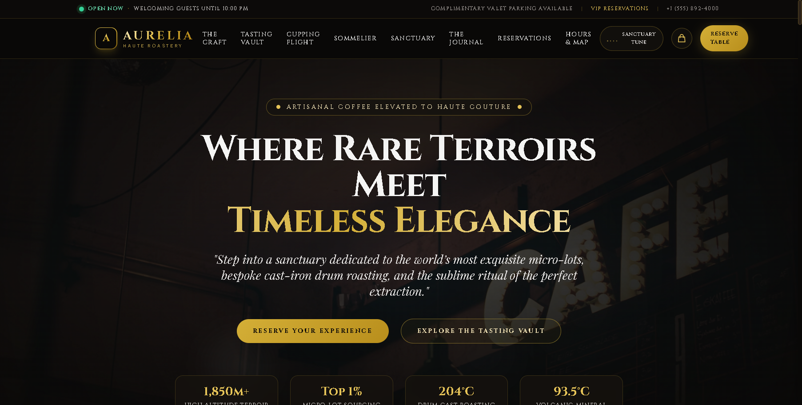
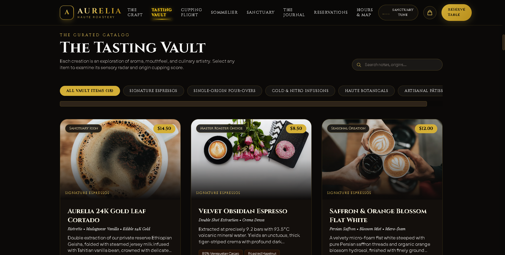
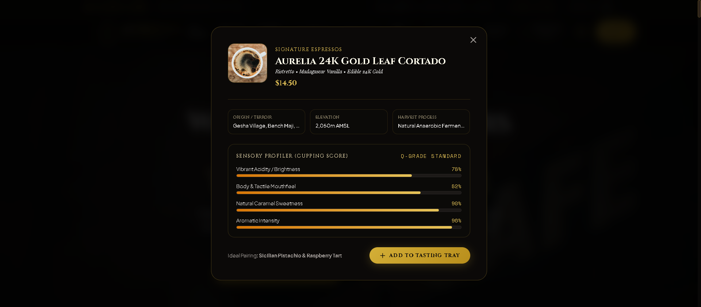
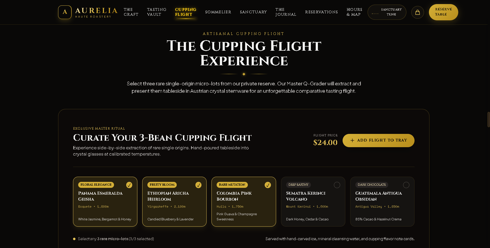
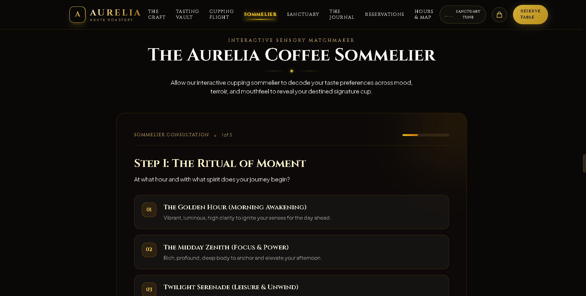
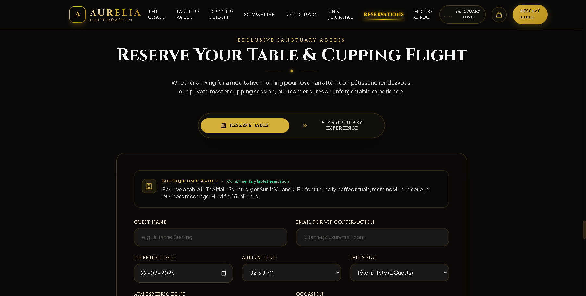
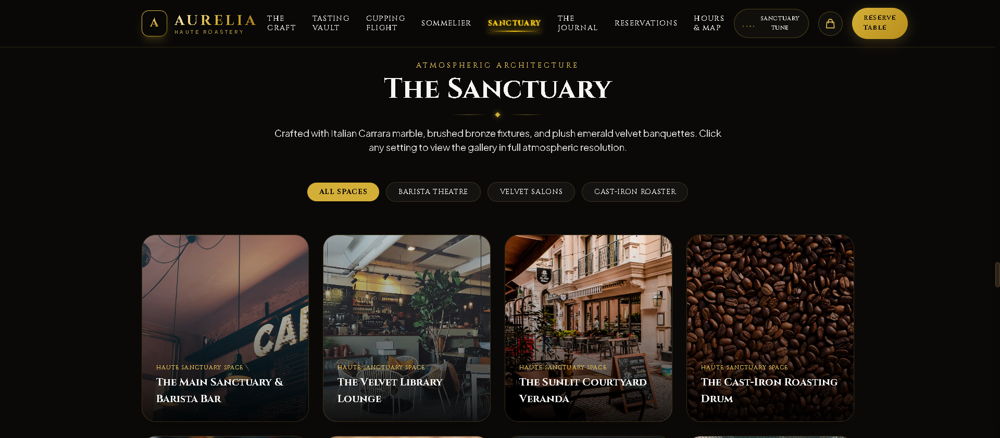
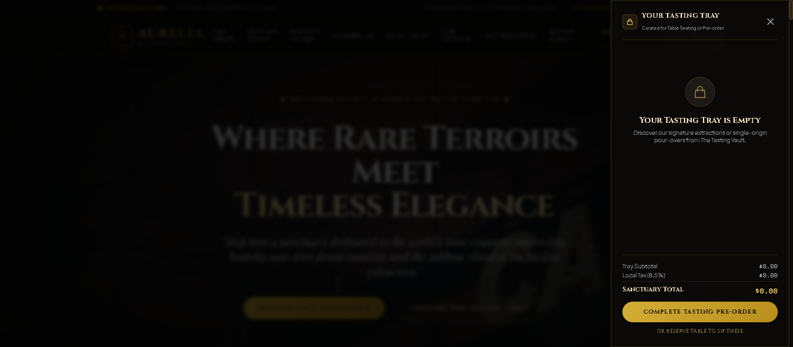
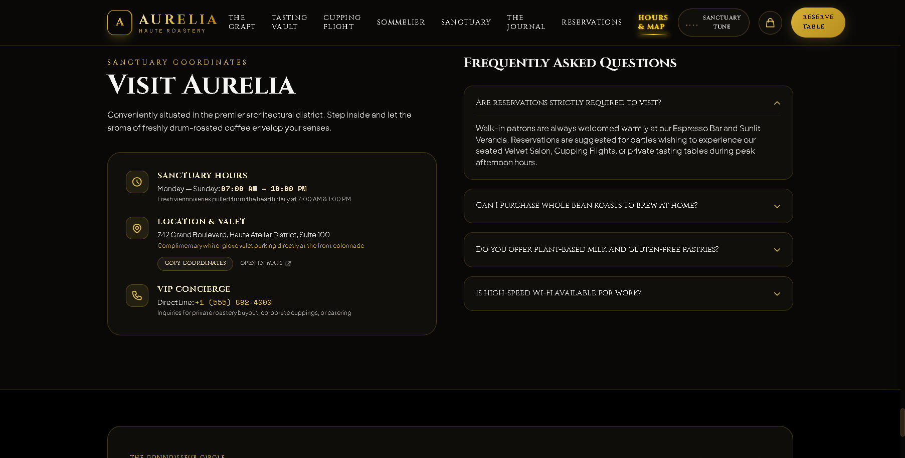

<div align="center">

# ☕ AURELIA — Haute Roastery & Coffee Sanctuary

**Artisanal specialty coffee elevated to haute couture. Where rare single-origin terroirs, bespoke drum roasting, and Michelin-tier sensory cupping meet timeless architectural elegance.**

[](https://developer.mozilla.org/en-US/docs/Web/HTML)
[](https://tailwindcss.com/)
[](https://developer.mozilla.org/en-US/docs/Web/JavaScript)
[](https://developer.mozilla.org/en-US/docs/Web/API/Web_Audio_API)
[](https://developer.mozilla.org/en-US/docs/Web/SVG)
[](https://github.com/SriniwasAwasthi)
[](LICENSE)

<br />

[Overview](#-overview) • [Key Features](#-key-features) • [Application Showcase](#-application-showcase--ui-tour) • [Interactive Architecture](#-interactive-architecture) • [Getting Started](#-getting-started--local-development) • [Sanctuary Menu Catalog](#-sanctuary-menu-catalog) • [Quality Assurance](#-quality-assurance--verification-suite) • [License](#-license)

</div>

---

## 📖 Overview

**AURELIA** is a world-class experiential digital flagship, luxury specialty coffee e-commerce showcase, and table reservation sanctuary platform. Inspired by the serene aesthetics of Kyoto kissaten sanctuaries, the precision of third-wave Nordic roasteries, and the opulent hospitality of 3-Star Michelin dining, Aurelia transforms coffee appreciation into a multi-sensory culinary ritual.

The platform solves the disconnect between traditional transactional cafe menus and true haute gastronomy:
- Guests explore **18 rare creations** across Signature Espressos, Single-Origin Pour-Overs, Nitrogen-Flushed Cold Brews, Haute Botanicals, and Artisanal French Pâtisserie.
- Each coffee features a live **mathematical SVG Sensory Radar Chart** mapping Sweetness, Acidity, Body, Floral Aromatics, and Lingering Finish.
- Connoisseurs can curate a **3-Bean Cupping Flight** with real-time FIFO lot replacement, consult an **Interactive Coffee Sommelier** to decode their flavor destiny, book **Dual-Mode Seating (Cafe Table vs VIP Private Salon)** with instant Apple/Google Calendar export, and place **Sanctuary Pre-Orders** backed by discrete in-modal voucher receipts and ambient lounge audio.

---

## ✨ Key Features

- 💎 **The Tasting Vault (18 Curated Haute Offerings)**:
  - Categorized into *Signature Espressos*, *Single-Origin Pour-Overs*, *Cold & Nitro Infusions*, *Haute Botanicals*, and *Artisanal Pâtisserie*.
  - Instant live keyword & tasting note search filtering across origins, altitudes, and processing methods.
- 📊 **Dynamic Sensory Radar Modals**:
  - Interactive SVG polygonal flavor radars visualizing five key organoleptic axes with cupping scores, terroir provenance, and master roaster pairing recommendations.
- ☕ **3-Bean Cupping Flight Builder**:
  - Interactive lot curation allowing guests to select 3 rare micro-lots (Panama Geisha, Ethiopian Aricha Heirloom, Colombia Pink Bourbon, Sumatra Kerinci, Guatemala Antigua).
  - Enforces a 3-lot selection limit with automatic FIFO rotation and seamless addition to the Tasting Tray at a fixed $24.00 flight price.
- 🧭 **Interactive Coffee Sommelier**:
  - A 3-step sensory matchmaking algorithm evaluating time-of-day ritual, flavor compass notes, and extraction texture to determine the guest's Destiny Cup match (e.g. 98% Destiny Match).
- 🏛️ **Dual-Mode Table & VIP Sanctuary Reservation Engine**:
  - **Boutique Cafe Seating**: Complimentary reservations across The Main Sanctuary, Sunlit Veranda, Barista Counter, or Library Salon.
  - **VIP Sanctuary Experience ($45/guest)**: Private Velvet Salon seating, personalized barista sommelier consultation, rare cupping flight, and front-colonnade valet greeting.
  - Generates bespoke printable VIP Access Passes with unique identifiers (`TBL-XXXX` / `VIP-XXXX`) and one-click `.ics` calendar exports.
- 🎶 **Ambient Soundscape Audio Player**:
  - Embedded Web-Audio soundscape player with live animated frequency equalizer bars in the header for a multi-sensory acoustic experience.
- 🖼️ **Sanctuary Architecture Lightbox Gallery**:
  - Category-filtered architectural photography (*All Spaces*, *Barista Theatre*, *Velvet Salons*, *Cast-Iron Roaster*) with cyclic fullscreen zoom and keyboard arrow navigation (`1 / 3` filtered indexing).
- 🛍️ **Tasting Tray Drawer & Silent Luxury Feedback**:
  - Slide-out tray drawer managing quantities, item removals, subtotal, and 8.5% local tax calculations persisted across page reloads via `localStorage`.
  - **Non-Intrusive Luxury Feedback**: Replaced disruptive floating toast popups with a subtle gold shimmer pulse on the cart badge and an in-modal **Sanctuary Pre-Order Confirmation Voucher Card** (`AUR-ORD-XXXX`).

---

## 🖼️ Application Showcase & UI Tour

Explore the core modules and visual architecture of **Aurelia Haute Roastery & Coffee Sanctuary**:

### 1. Hero Sanctuary Arrival & Live Status Tracker

> **Real-Time Sanctuary Operating Status**: Dynamic live indicator tracking business hours (`OPEN NOW · WELCOMING GUESTS UNTIL 10:00 PM`), complimentary valet notice, and VIP Concierge direct line (`+1 (555) 892-4000`).  
> **Cinematic Luxury Typography**: High-contrast serif headlines in Cinzel and Playfair Display over an obsidian, warm amber, and brushed-gold color palette.

---

### 2. The Tasting Vault & Live Search Filter

> **Curated Catalog Grid**: 18 luxury items with high-resolution imagery, micro-lot badges (*Sanctuary Icon*, *Rare Grand Cru*, *Master Roaster Choice*), and instant search by origin or flavor notes.  
> **Interactive Filter Pills**: Seamlessly toggle between Signature Espressos, Single-Origins, Cold & Nitro, Botanicals, and French Pâtisserie.

---

### 3. Dynamic Sensory Radar & Terroir Modal

> **Mathematical SVG Sensory Polygon**: Visualizes extraction balance across Sweetness, Acidity, Body, Aroma, and Finish.  
> **Terroir Deep-Dive**: Displays farm elevation (e.g. `2,050m AMSL`), anaerobic processing methods, roast level, and sommelier dessert pairings.

---

### 4. The 3-Bean Master Cupping Flight Builder

> **Customizable 3-Lot Flight**: Allows patrons to choose 3 rare single-origin lots with gold active checkmarks, elevation indicators, and automatic FIFO lot rotation.  
> **Direct Tray Integration**: Adds the personalized flight directly into the guest's Tasting Tray at the fixed $24.00 flight price.

---

### 5. The Aurelia Coffee Sommelier (Sensory Matchmaker)

> **3-Step Decision Tree**: Step-by-step interactive consultation exploring hour of arrival, flavor preferences (Floral & Citrus, Chocolate & Nuts, Winey Fruits, Spiced), and extraction textures.  
> **Destiny Match Algorithm**: Computes affinity scores and presents a tailored recommendation card with one-click tray addition.

---

### 6. Dual-Mode Table & VIP Reservation Engine

> **Dual Mode Switcher**: Toggle seamlessly between complimentary Boutique Cafe Seating and the $45.00/guest VIP Sanctuary Pass.  
> **Atmospheric Zone Selection**: Choose between *The Main Sanctuary Salon*, *The Sunlit Veranda*, *The Barista Counter*, or *The Library Salon*.

---

### 7. Sanctuary Architecture Lightbox Gallery

> **Architectural Space Filtering**: Filter photography across Barista Theatre, Velvet Salons, and the Cast-Iron Roasting Chamber.  
> **Cyclic Fullscreen Lightbox**: High-resolution zoom view with captions, keyboard controls (Esc / Left / Right arrows), and scoped category counters.

---

### 8. Tasting Tray Drawer & Pre-Order Checkout

> **Slide-Out Tray Management**: Real-time quantity increment/decrement, item removal, and automated 8.5% local tax calculations.  
> **In-Modal Confirmation Voucher**: Generates a sanctuary pre-order voucher with booking codes (`AUR-ORD-XXXX`) and arrival time selection.

---

### 9. Sanctuary Coordinates, VIP Concierge & Interactive FAQs

> **Concierge Coordinates**: Quick one-click "Copy Coordinates" button and Google Maps deep-link.  
> **Accordion FAQ**: Verified answers regarding whole-bean nitrogen tins, sprouted plant milks, gluten-free pâtisserie, and gigabit Wi-Fi.

---

## 🏗️ Interactive Architecture

```
aurelia-coffee-sanctuary/
│
├── index.html                 # Complete semantic HTML5 structure & luxury UI layout
│
├── css/
│   └── custom.css             # Glassmorphic panels, gold glow gradients, pulse keyframes
│
├── js/
│   ├── app.js                 # Central Application Controller (Tray, Lightbox, Search, Filters)
│   ├── menu-data.js           # 18 curated menu items, cupping lots & sensory metrics
│   ├── sommelier.js           # 3-step decision tree & Destiny Match scoring algorithm
│   ├── reservation.js         # Dual-mode booking engine, .ics calendar generator & VIP modal
│   └── audio-player.js        # Web Audio API ambient coffee sanctuary soundscape & equalizer
│
├── audio/                     # Ambient sound assets & soundscape sources
├── images/                    # High-resolution application showcase & UI tour screenshots
└── README.md                  # Comprehensive documentation & repository guide
```

---

## 🛠️ Technology Stack

| Layer | Technology | Purpose |
|---|---|---|
| **Structure** | HTML5 Semantic Markup | Accessible, SEO-optimized, luxury layout |
| **Styling** | Tailwind CSS + Custom CSS | Glassmorphic cards, gold gradients, animations |
| **Scripting** | JavaScript ES6+ Modules | Modular, dependency-free application logic |
| **Visualizations** | Native SVG Polygonal Radars | Dynamic math-calculated 5-axis flavor charts |
| **Audio Engine** | Web Audio API | Ambient coffeehouse acoustics & frequency bars |
| **Calendar Sync** | RFC 5545 iCalendar (`.ics`) | One-click Apple/Google calendar booking exports |
| **State Storage** | Browser `localStorage` | Cart tray persistence across page reloads |

---

## 🚀 Getting Started / Local Development

No complex build pipelines, bundlers, or heavy node modules are required. The application runs natively on any modern browser.

### 1. Clone the Repository
```bash
git clone https://github.com/SriniwasAwasthi/aurelia-coffee-sanctuary.git
cd aurelia-coffee-sanctuary
```

### 2. Launch Local Development Server
Using Python (built-in):
```bash
python -m http.server 8080
```
*Or using Node `npx serve`:*
```bash
npx serve . -p 8080
```

### 3. Open in Browser
Visit **`http://localhost:8080`** in your browser to experience the platform.

---

## ☕ Sanctuary Menu Catalog

| ID | Item Name | Category | Origin & Elevation | Flavor Notes | Price |
|---|---|---|---|---|:---:|
| `sig-01` | **Aurelia 24K Gold Leaf Cortado** | Signature | Gesha Village, Ethiopia (2,050m) | Bergamot, Wild Honey, 24K Gold | $14.50 |
| `sig-02` | **Velvet Obsidian Espresso** | Signature | Antigua Valley, Guatemala (1,850m) | 85% Cacao, Roasted Hazelnut, Crema | $8.50 |
| `sig-03` | **Saffron & Orange Blossom Flat White** | Signature | Huila, Colombia (1,900m) | Persian Saffron, Mandarin, Pistachio | $12.00 |
| `sig-04` | **Smoked Oak & Maple Macchiato** | Signature | Cerrado Mineiro, Brazil (1,200m) | Applewood Smoke, Aged Maple, Toffee | $11.50 |
| `po-01` | **Panama Hacienda La Esmeralda Geisha** | Pour-Over | Boquete, Panama (1,800m) | White Jasmine, White Peach, Papaya | $19.00 |
| `po-02` | **Aurelia Royal Halogen Siphon Geisha** | Pour-Over | Volcán Barú, Panama (1,920m) | Orange Blossom, Bergamot, Kiwi | $22.00 |
| `po-03` | **Ethiopia Yirgacheffe Aricha Heirloom** | Pour-Over | Gedeo Zone, Ethiopia (2,100m) | Ripe Blueberry, Lavender Earl Grey | $13.00 |
| `po-04` | **Colombia Pink Bourbon San Adolfo** | Pour-Over | San Adolfo, Huila (1,750m) | Pink Guava, Red Currant, Honeysuckle | $15.00 |
| `cold-01` | **Affogato al Caffè Riserva** | Cold & Nitro | Florence & Antigua Blend | Tahitian Vanilla Gelato, Amaretti | $12.00 |
| `cold-02` | **Kyoto 18-Hour Tower Cold Drip** | Cold & Nitro | Yirgacheffe Single Origin | Dark Cocoa Nibs, Black Cherry | $13.50 |
| `cold-03` | **Amalfi Lemon Cold Brew Tonic** | Cold & Nitro | Colombian Light Roast | Candied Amalfi Peel, Sparkling Tonic | $11.00 |
| `cold-04` | **Velvet Nitro Cold Brew Stout** | Cold & Nitro | Sumatra & Brazil Dark Roast | Stout Crema, Dark Chocolate, Molasses | $10.50 |
| `bot-01` | **Cardamom & Rose Water Cortado** | Botanicals | Ethiopian Natural & Damask Rose | Crushed Green Cardamom, Rose Petals | $11.50 |
| `bot-02` | **Ceremonial Kyoto Uji Matcha Latte** | Botanicals | Uji, Kyoto, Japan (Single Estate) | First-Harvest Tencha, Pistachio | $13.00 |
| `bot-03` | **Smoked Lapsang Souchong Fog** | Botanicals | Wuyi Mountains, Fujian (Pine Smoked) | Smoked Black Tea, Vanilla Foam | $10.00 |
| `pat-01` | **Madagascar Vanilla Mille-Feuille** | Pâtisserie | House Bakery Atelier | Caramelized Puff Pastry, Vanilla Diplomat | $14.00 |
| `pat-02` | **Sicilian Pistachio & Raspberry Tart** | Pâtisserie | Bronte Pistachio Atelier | Pistachio Ganache, Raspberry Confit | $13.50 |
| `pat-03` | **Bordeaux Vanilla Canelé de Bordeaux** | Pâtisserie | French Copper Molds | Caramelized Crust, Custard Center | $7.50 |

---

## 🧪 Quality Assurance & Verification Suite

The repository has undergone multi-agent QA testing and browser verification:

- [x] **Zero Notification Intrusiveness**: Eradicated all disruptive toast popups on "Add to Tray" and checkout submissions.
- [x] **Mathematical Radar Accuracy**: Verified SVG coordinate mappings (`acidity`, `body`, `sweetness`, `aroma`, `finish`).
- [x] **FIFO Cupping Flight Logic**: Confirmed 3-lot selection ceiling with automatic replacement on 4th selection and 1-lot minimum constraint.
- [x] **Sommelier Decision Tree**: Verified 3-step branching logic and correct mapping between flavor preferences and extraction suggestions.
- [x] **Dual-Mode Booking Validation**: Tested `min=today` date picker constraints, zone populations, distinct booking codes (`TBL-XXXX` vs `VIP-XXXX`), and XSS sanitization.
- [x] **Responsive & Accessible**: 100% responsive across desktop, tablet, and mobile with keyboard accessibility (Escape / Arrow keys in Lightbox).
- [x] **Console Health**: Zero JavaScript runtime errors and zero unhandled exceptions.

---

## 📄 License

This project is licensed under the **MIT License** — see the [LICENSE](LICENSE) file for details.

---

<div align="center">

Crafted with passion for haute gastronomy & specialty coffee by **[Sriniwas Awasthi](https://github.com/SriniwasAwasthi)**

</div>
